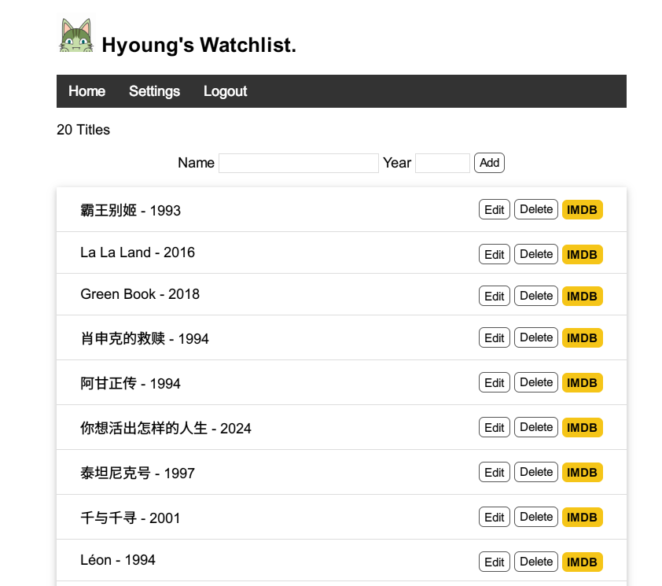

# Page 3

Created: June 1, 2024 11:07 PM

## **A Simple Watchlist**

### 部署地址

[http://yzlevol.pythonanywhere.com/](http://yzlevol.pythonanywhere.com/)

### 技术栈

- **Flask：**Web框架，用于创建Web应用与处理Http请求
- **Sqlite：**轻量级数据库，用于存储和检索应用的数据
- **Jinja2：**Flask 使用的模板引擎，用于渲染 HTML 模板